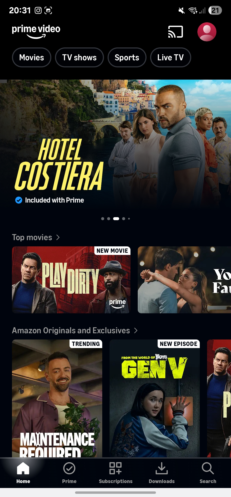
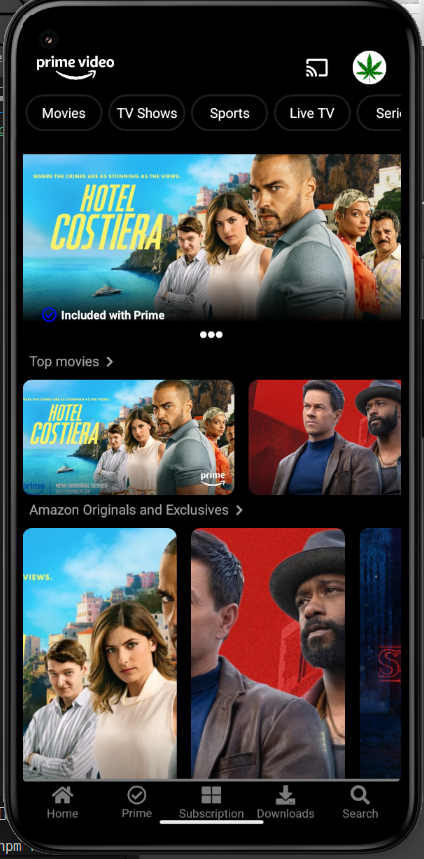

# 🧩 PGL-Appscreen-PrimeVideo

Primera práctica de Dispositivos Multimedia, un scraping de la app Prime Video en un proyecto React Native con Typescript.

---

## 📸 Capturas de Pantalla

  
  

---

## Ejercicios

### Primer ejercicio

[📘 Ver ejercicio uno.](docs/colores.md)

### Segundo ejercicio

[📘 Ver ejercicio dos.](docs/atomic_design.md)

### Tercer ejercicio

[📘 Ver ejercicio dos.](docs/explain_code.md)

### cuarto ejercicio

[📘 Ver ejercicio dos.](docs/icons.md)
